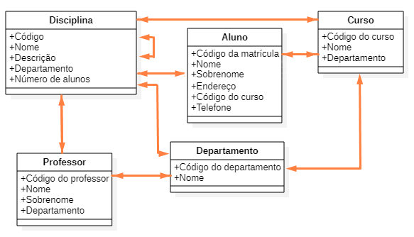

## Modelagem de Banco de Dados

### Objetivo
* Modelar um banco de dados para gerenciamento de uma faculdade.
* Realizar controle centralizado de alunos, professores, cursos, disciplinas, histórico escolar e turmas

### Fases
1. Levantamento dos requisitos
2. Identificação de entidades e relacionamentos
3. Modelo ER
4. Diagrama ER
5. Dicionário de dados
6. Normalização
7. Implementação
8. Testes básicos

---

### 1. Levantamento de Requisitos (Regras de Negócios)
* Um aluno só pode estar matriculado em um curso por vez
* Alunos possuem um código de identificação (RA)
* Cursos são compostos por disciplinas
* Cada disciplina terá no máximo 30 alunos por turma
* As disciplinas podem ser obrigatórias ou optativas
* As disciplinas pertencem a departamentos específicos
* Cada disciplina possui um código de identificação
* Alunos podem trancar matrícula, não estando então matriculados em nenhuma disciplina no semestre
* Em cada semestre, cada aluno pode se matricular em, no máximo 9, disciplinas
* O aluno só pode ser reprovado, no máximo, 3 vezes na mesma disciplina
* A faculdade terá no máximo 3 mil alunos, matriculados simultaneamente, em 10 cursos distintos
* Entram 300 alunos novos por ano
* Existem 90 disciplinas no total disponíveis
* Um histórico escolar traz todas as disciplinas cursadas por aluno, incluindo nota final, frequência e período do curso realizado
* Professores podem ser cadastrados mesmo sem lecionar disciplinas
* Existem 40 professores trabalhando na escola
* Cada professor irá lecionar, no máximo, 4 disciplinas diferentes
* Cada professor é vinculado a um departamento
* Professores são identificados por um código de professor

## 2. Identificação das Entidades e Relacionamentos

### Entidades
* Aluno
* Professore
* Disciplina
* Curso
* Departamento

### Relacionamentos
* [Aluno] -> matriculado -> [Curso]
* [Aluno] -> cursa -> [Disciplina]
* [Aluno] -> realizou -> [Disciplina]
* [Disciplina] -> pertence -> [Curso]
* [Professor] -> leciona -> [Disciplina]
* [Professor] -> vinculado -> [Departamento]
* [Departamento] -> responsável -> [Disciplina]
* [Departamento] -> controla -> [Curso]
* [Disciplina] -> depende -> [Disciplina]

### Atributos (Aluno)
* Número de matrícula
* Nome
* Sobrenome
* Endereço (rua, número, bairro, CEP, cidade, estado)
* Código do curso

### Atributos (Professor)
* Código do professor
* Nome
* Sobrenome
* Código do departamento
* Status

### Atributos (Disciplina)
* Código da disciplina
* Nome da disciplina
* Descrição curricular
* Código do departamento
* Número de alunos

### Atributos (Curso)
* Código do curso
* Nome do curso
* Código do departamento

### Atributos (Departamento)
* Código do departamento
* Nome do departamento

## Diagrama ER

(imagem)

## Dicionário de Dados

Entidade|Relacionamento|Nome do Relacionamento|Descrição da Entidade
--------|--------------|----------------------|---------
Departamento|Professor|Percente|Tabela para cadastro dos departamentos da faculdade
||Curso|Controla||
||Disciplina|Gerencia
|Professor|Departamento|Pertence|Tabvela para cadastro dos professores da faculdade
||Prof_Disciplina|Leciona
Turma|Curso|Gera|Tabela para registro das turmas em andamento e encerradas
||Aluno|Percence
Curso|Departamento|Controla|Tabela para cadastro dos cursos oferecidos pela faculdade
||Turma|Gera
||Aluno|Matriculado
||Curso_Disciplina|Possui
Aluno|Curso|Matriculado|Tabela para cadastro das informações sobre alunos da faculdade
||Turma|Pertence
||Disciplina|Cursa
||Histórico|Pertence
Disciplina|Aluno|Cursa|Tabela para cadastro das disciplinas que compõem os cursos oferecidos pela faculdade
||Departamento|Gerencia
||Prof_Disciplina|É Lecionada
||Curso_Disciplina|Pertence
||Disciplina|Depende
||Disc_Hist|Compõe
Histórico|Aluno|Pertence|Tabela para geração de histórico de notas e frequência de alunos
Disc_Hist|Disciplina|Compõe|Tabela associativa entre disciplina e histórico
||Histórico|É Composto|
Curso_Disciplina|Curso|Possui|Tabela associativa entre curso e disciplina
||Disciplina|Pertence
Prof_Disciplina|Professor|Leciona|Tabela associativa entre professor e disciplina
||Disciplina|É Lecionada

### Entidade Departamento
Atributo|Tipos de dados|Comprimento|Restrições|Descrição
--------|--------------|-----------|----------|---------
Cod_Departamento|Inteiro|4 bytes|PK, NOT NULL|Código de identificação do departamento
Nome_Departamento|Caractere|40 bytes|NOT NULL|Nome do departamento

### Entidade Professor
Atributo|Tipos de dados|Comprimento|Restrições|Descrição
--------|--------------|-----------|----------|---------
Cod_Professor|Inteiro|4 bytes|PK, NOT NULL|Código de identificação do professor
Nome_Professor|Caractere|40 bytes|NOT NULL|Nome do professor
Sobrenome_Professor|Caractere|40 bytes|NOT NULL|Sobrenome do professor
Cod_Departamento|Inteiro|4 bytes|FK, NOT NULL|Código de identificação do departamento
Status|Booleano|1 bit|NOT NULL|Status do professor(lecionando ou não)

### Entidade Curso
Atributo|Tipos de dados|Comprimento|Restrições|Descrição
--------|--------------|-----------|----------|---------
Cod_Curso|Inteiro|4 bytes|PK, NOT NULL|Código de identificação do curso
Nome_Curso|Caractere|40 bytes|NOT NULL|Nome do curso
Cod_Departamento|Inteiro|4 bytes|FK, NOT NULL|Código de identificação do departamento

### Entidade Curso
Atributo|Tipos de dados|Comprimento|Restrições|Descrição
--------|--------------|-----------|----------|---------
Cod_Turma|Inteiro|4 bytes|PK, NOT NULL|Código de identificação da turma
Cod_Curso|Inteiro|4 bytes|FK, NOT NULL|Código de identificação do curso
Período|Caractere|10 bytes|NOT NULL|Período da turma (manhã, tarde, noite)
Num_Alunos|Inteiro|2 bytes|NOT NULL|Número de alunos matriculados na turma
Data_Inicio|Data|4 bytes|NOT NULL|Data de início da turma
Data_Fim|Data|4 bytes|NOT NULL|Data de fim da turma

### Entidade Aluno
Atributo|Tipos de dados|Comprimento|Restrições|Descrição
--------|--------------|-----------|----------|---------
RA|Caractere|8 bytes|PK, NOT NULL|Código de identificação do aluno
Nome_Aluno|Caractere|25 bytes|NOT NULL|Nome do aluno
Sobrenome_Aluno|Caractere|40 bytes|NOT NULL|Sobrenome do aluno
CPF|Caractere|40 bytes|NOT NULL|CPF do aluno
Telefone|Caractere|40 bytes|NOT NULL|Telefones* do aluno
Status|Caractere|1 byte|NOT NULL|Status da matrícula do aluno
Contato|Caractere|NOT NULL|Formas de contato com o aluno
Cod_Turma|Inteiro|4 bytes|FK, NOT NULL|Código de identificação da turma
Cod_Curso|Inteiro|4 bytes|FK, NOT NULL|Código de identificação do curso
Sexo||Caractere|1 byte|NOT NULL|Sexo do aluno
Filiação|Caractere|80|NOT NULL|Nome da mae do aluno
Endereço|Rua,Número,CEP|Caractere|80B,10B,10B|NOT NULL|Endereço do aluno

### Entidade Disciplina
Atributo|Tipos de dados|Comprimento|Restrições|Descrição
--------|--------------|-----------|----------|---------
Cod_Disciplina|Inteiro|4 bytes|PK, NOT NULL|Código de identificação da disciplina
Nome_Disciplina|Caractere|30B|NOT NULL|Nome da disciplina
Descrição|Caractere|200B|NULL|Descrição da disciplina
Cod_Departamento|Inteiro|4 bytes|FK, NOT NULL|Código do departamento responsável pela disciplina
Carga_Horaria|Inteiro|4 b ytes|NOT NULL|Carga horária do curso
Num_Alunos|Inteiro|4 bytes|NOT NULL|Número de alunos

### Entidade Histórico
Atributo|Tipos de dados|Comprimento|Restrições|Descrição
--------|--------------|-----------|----------|---------
Cod_Historico|Inteiro|4 bytes|PK, NOT NULL|Código de identificação do histórico
RA|Caractere|FK, NOT NULL|Código de identificação do aluno
Período_Realização|Inteiro|4B|NOT NULL|Duração de realização da disciplina (em meses)

### Entidade Disc_Hist
Atributo|Tipos de dados|Comprimento|Restrições|Descrição
--------|--------------|-----------|----------|---------
Cod_Historico|Inteiro|4 bytes|PK, FK, NOT NULL|Código de identificação do histórico
Cod_Disciplina|Inteiro|4 bytes|PK, FK, NOT NULL|Código de identificação da disciplina
Nota|Decimal|8 bytes|NOT NULL|Nota da disciplina
Frequência|Inteiro|4 bytes|NOT NULL|Número de faltas na disciplina

### Entidade Curso_Disciplina
Atributo|Tipos de dados|Comprimento|Restrições|Descrição
--------|--------------|-----------|----------|---------
Cod_Disciplina|Inteiro|4 bytes|PK, FK, NOT NULL|Código de identificação da disciplina
CodCurso|Inteiro|4 bytes|PK, FK, NOT NULL|Código de identificação do curso

### Entidade Prof_Disciplina
Atributo|Tipos de dados|Comprimento|Restrições|Descrição
--------|--------------|-----------|----------|---------
Cod_Disciplina|Inteiro|4 bytes|PK, FK, NOT NULL|Código de identificação da disciplina
Cod_Professor|Inteiro|4 bytes|PK, FK, NOT NULL|Código de identificação da disciplina

### Entidade Aluno_Disciplina
Atributo|Tipos de dados|Comprimento|Restrições|Descrição
--------|--------------|-----------|----------|---------
Cod_Disciplina|Inteiro|4 bytes|PK, FK, NOT NULL|Código de identificação da disciplina
RA|Caractere|8 bytes|PK, FK, NOT NULL|Código de identificação do aluno
